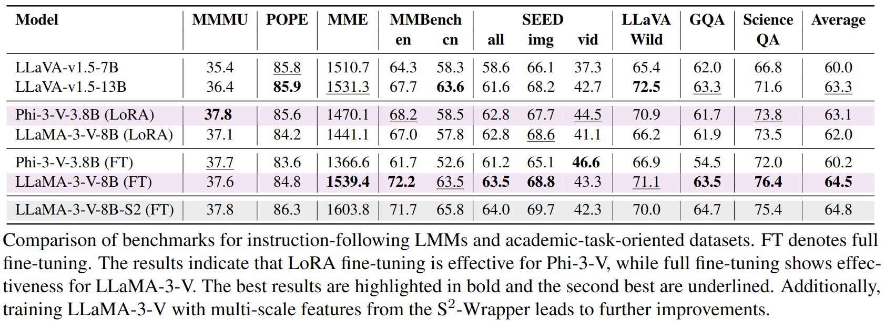

# LLaVA++: Extending Visual Capabilities with LLaMA-3 and Phi-3
<p align="center">
    
</p>

#### [Hanoona Rasheed](https://www.hanoonarasheed.com/)\*, [Muhammad Maaz](https://www.muhammadmaaz.com)\*, [Salman Khan](https://salman-h-khan.github.io/), and [Fahad Khan](https://sites.google.com/view/fahadkhans/home)
\* Equal contributions

#### **Mohamed bin Zayed University of AI (MBZUAI)**

[](https://colab.research.google.com/drive/10Z2HaY5zvy2GZZ4v245PtiDPukm0NbF6?usp=sharing)
[](https://bengal-eminent-wasp.ngrok-free.app)
[](https://huggingface.co/spaces/MBZUAI/LLaMA-3-V)
[](https://huggingface.co/spaces/MBZUAI/Phi-3-V)

---

## 📢 Latest Updates
- **Apr-30-24**- LLaMA-3-V and Phi-3-V demos are now available via Hugging Face Spaces. Check them out at [LLaMA-3-V](https://huggingface.co/spaces/MBZUAI/LLaMA-3-V) &  [Phi-3-V](https://huggingface.co/spaces/MBZUAI/Phi-3-V) 🔥🔥🔥
- **Apr-28-24**- Online demo of Phi-3-V and LLaMA-3-V are released, check them out at [Online Demo](https://bengal-eminent-wasp.ngrok-free.app) 🔥🔥🔥
- **Apr-28-24**- LoRA, fully fine-tuned and [S<sup>2</sup>](https://github.com/bfshi/scaling_on_scales.git) fine-tuned models and results are added! 🔥🔥🔥
- **Apr-27-24**- Google Colab is released to chat with Phi-3-V-3.8B model, check it out at [Google Colab](https://colab.research.google.com/drive/10Z2HaY5zvy2GZZ4v245PtiDPukm0NbF6?usp=sharing) 🔥🔥🔥
- **Apr-26-24**- Phi-3-V and LLaVA-3-V released: Excited to release the new integration of LLaVA with Phi-3 Mini Instruct and LLaMA-3 Instruct models! [Hugging Face](https://huggingface.co/collections/MBZUAI/llava-662b38b972e3e3e4d8f821bb) 🔥🔥🔥

---
<p align="center">
  
</p>

## 💬 Introduction
This repository enhances the capabilities of the LLaVA 1.5 model, incorporating latest LLMs released this weak🔥, [Phi-3 Mini Instruct 3.8B](https://huggingface.co/microsoft/Phi-3-mini-4k-instruct), and [LLaMA-3 Instruct 8B](https://huggingface.co/meta-llama/Meta-Llama-3-8B).


## 🏆 Results: Phi-3-V and LLaVA-3-V
<p align="center">
  
</p>

### Comparison on Benchmarks for Instruction-following LMMS & academic-task-oriented datasets:

<p align="center">
  
</p>

- Average computed excluding MME, and second-best are underlined.


## 🤖 Model-Zoo

The following table provides an overview of the available models in our zoo. For each model, you can find links to its Hugging Face page. 

| Model Name                            |                             Hugging Face Link                              | Summary                                                                                                           |
|---------------------------------------|:--------------------------------------------------------------------------:|-------------------------------------------------------------------------------------------------------------------|
| LLaVA-Phi-3-mini-4k-instruct-pretrain | [Hugging Face](https://huggingface.co/MBZUAI/LLaVA-Phi-3-mini-4k-instruct-pretrain)  | Pretrained on [LCS-558K](https://huggingface.co/datasets/liuhaotian/LLaVA-Pretrain).                              |
| LLaVA-Phi-3-mini-4k-instruct-lora     |   [Hugging Face](https://huggingface.co/MBZUAI/LLaVA-Phi-3-mini-4k-instruct-lora)    | LoRA weights fine-tuned on [LLaVA-Instruct-665K](https://huggingface.co/datasets/liuhaotian/LLaVA-Instruct-150K). |
| LLaVA-Phi-3-mini-4k-instruct          |      [Hugging Face](https://huggingface.co/MBZUAI/LLaVA-Phi-3-mini-4k-instruct)      | Merged LoRA weights in HuggingFace format.                                                                        |
| LLaVA-Phi-3-mini-4k-instruct-FT       |      [Hugging Face](https://huggingface.co/MBZUAI/LLaVA-Phi-3-mini-4k-instruct-FT)      | Fully fine-tuned model weights in HuggingFace format.                                                             |

| Model Name                              |                                   Hugging Face Link                                   | Summary                                                                                                           |
|-----------------------------------------|:-------------------------------------------------------------------------------------:|-------------------------------------------------------------------------------------------------------------------|
| LLaVA-Meta-Llama-3-8B-Instruct-pretrain | [Hugging Face](https://huggingface.co/MBZUAI/LLaVA-Meta-Llama-3-8B-Instruct-pretrain) | Pretrained on [LCS-558K](https://huggingface.co/datasets/liuhaotian/LLaVA-Pretrain).                              |
| LLaVA-Meta-Llama-3-8B-Instruct-lora     |        [Hugging Face](https://huggingface.co/MBZUAI/LLaVA-Meta-Llama-3-8B-Instruct-lora)        | LoRA weights fine-tuned on [LLaVA-Instruct-665K](https://huggingface.co/datasets/liuhaotian/LLaVA-Instruct-150K). |
| LLaVA-Meta-Llama-3-8B-Instruct          |          [Hugging Face](https://huggingface.co/MBZUAI/LLaVA-Meta-Llama-3-8B-Instruct)           | Merged weights in HuggingFace format.                                                                             |
| LLaVA-Meta-Llama-3-8B-Instruct-FT       |          [Hugging Face](https://huggingface.co/MBZUAI/LLaVA-Meta-Llama-3-8B-Instruct-FT)           | Fully fine-tuned model weights in HuggingFace format.                                                             |
| LLaVA-Meta-Llama-3-8B-Instruct-FT-S2    |          [Hugging Face](https://huggingface.co/MBZUAI/LLaVA-Meta-Llama-3-8B-Instruct-FT-S2)           | Fully fine-tuned S2 model weights in HuggingFace format.                                                          |


# Installation

```bash
git clone https://github.com/mbzuai-oryx/LLaVA-pp.git
cd LLaVA-pp
git submodule update --init --recursive
```
Packages you need to update from LLAVA:
```bash
pip install git+https://github.com/huggingface/transformers@a98c41798cf6ed99e1ff17e3792d6e06a2ff2ff3
```

## 🚀 Phi-3-V
To integrate Phi-3-V with LLaVA, follow these steps to update the codebase:

```bash
# Copy necessary files
cp Phi-3-V/train.py LLaVA/llava/train/train.py
cp Phi-3-V/llava_phi3.py LLaVA/llava/model/language_model/llava_phi3.py
cp Phi-3-V/builder.py LLaVA/llava/model/builder.py
cp Phi-3-V/model__init__.py LLaVA/llava/model/__init__.py
cp Phi-3-V/main__init__.py LLaVA/llava/__init__.py
cp Phi-3-V/conversation.py LLaVA/llava/conversation.py

# Training commands
cp scripts/Phi3-V_pretrain.sh LLaVA/Vi-phi3_pretrain.sh
cp scripts/Phi3-V_finetune_lora.sh LLaVA/Vi-phi3_finetune_lora.sh
```

### Train Phi-3-V
1. Pre-train
```bash
cd LLaVA
bash Phi3-V_pretrain.sh
```
2. Finetune
```bash
cd LLaVA
bash Phi3-V_finetune_lora.sh
```

## 🚀 LLaMA-3-V
To integrate LLaMA-3-V with LLaVA, follow these steps to update the codebase:

```bash
# Copy necessary files
cp LLaMA-3-V/train.py LLaVA/llava/train/train.py
cp LLaMA-3-V/conversation.py LLaVA/llava/conversation.py
cp LLaMA-3-V/builder.py LLaVA/llava/model/builder.py
cp LLaMA-3-V/llava_llama.py LLaVA/llava/model/language_model/llava_llama.py

# Training commands
cp scripts/LLaMA3-V_pretrain.sh LLaVA/LLaMA3-V_pretrain.sh
cp scripts/LLaMA3-V_finetune_lora.sh LLaVA/LLaMA3-V_finetune_lora.sh
```

### Train LLaMA-3-V
1. Pre-train
```bash
cd LLaVA
bash LLaMA3-V_pretrain.sh
```
2. Finetune
```bash
cd LLaVA
bash LLaMA3-V_finetune_lora.sh
```

---
## 🙏 Acknowledgement
We are thankful to [LLaVA](https://github.com/haotian-liu/LLaVA.git), [lmms-eval](https://github.com/EvolvingLMMs-Lab/lmms-eval.git) and [S<sup>2</sup>-Wrapper](https://github.com/bfshi/scaling_on_scales.git) for releasing their models and code as open-source contributions.

In case if you face any issues or have any questions, please feel free to create an issue or reach out at [hanoona.bangalath@mbzuai.ac.ae](hanoona.bangalath@mbzuai.ac.ae) & [muhammad.maaz@mbzuai.ac.ae](muhammad.maaz@mbzuai.ac.ae).

## 📜 Citation
```bibtex
  @misc{hanoona2024LLaVA++,
          title={LLaVA++: Extending Visual Capabilities with LLaMA-3 and Phi-3},
          author={Rasheed, Hanoona and Maaz, Muhammad and Khan, Salman and Khan, Fahad S.},
          url={https://github.com/mbzuai-oryx/LLaVA-pp},
          year={2024}
  }
```

---
[](https://www.ival-mbzuai.com)
[](https://github.com/mbzuai-oryx)
[](https://mbzuai.ac.ae)
